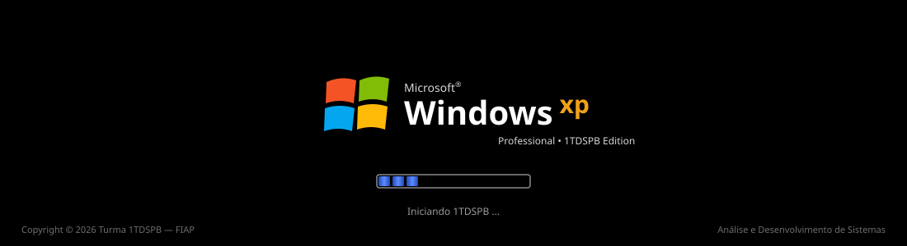
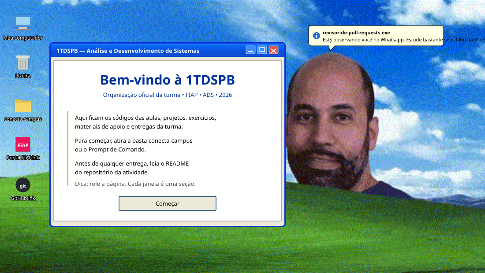
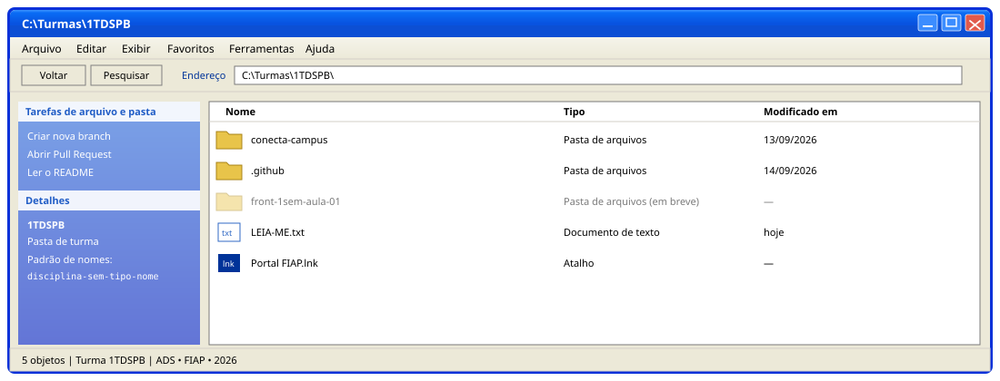
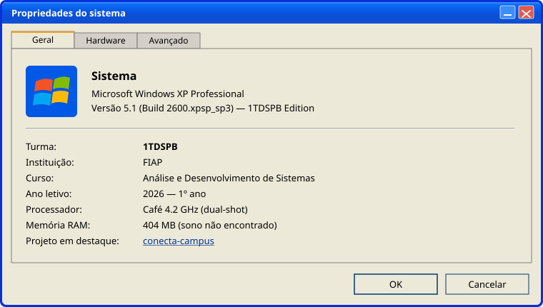
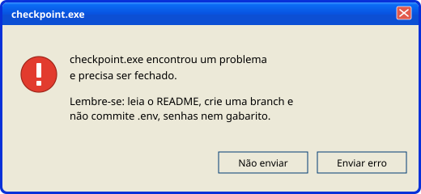
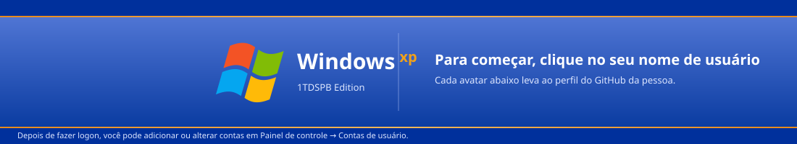
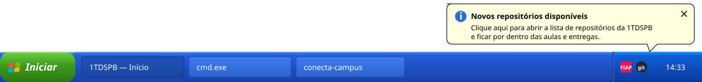

<!--
  1TDSPB - perfil da organização (tema Windows XP)
  Cada bloco abaixo é uma "janela": uma barra de título em SVG (./assets/win-*.svg)
  seguida do conteúdo em Markdown. Para criar uma nova janela, copie um bloco <table>.
-->

 

<!-- ======================= SOBRE ======================= -->
<table>
<tr><td></td></tr>
<tr><td>

Esta é a organização oficial da turma **1TDSPB** (Análise e Desenvolvimento de Sistemas, FIAP, 2026). Aqui ficam centralizados os códigos construídos em aula, projetos, exercícios, materiais de apoio e entregas ao longo do semestre.

**Como funciona**

1. **Um repositório por aula ou tema.** A cada encontro, o repositório correspondente é atualizado com o código construído ao vivo, comentários explicativos e eventuais exercícios.
2. **Atualizações.** Os códigos são publicados logo após o início da aula. Um `git pull` antes de começar evita surpresas.

**Antes de começar qualquer atividade, leia o README do repositório dela.** Ele contém instruções, requisitos, prazos e critérios de avaliação.

</td></tr>
</table>

 

<!-- ======================= ACESSO RÁPIDO ======================= -->
<table>
<tr><td></td></tr>
<tr><td>

| Atalho | Destino | |
|:--|:--|:--:|
| **Meus documentos** | Todos os repositórios da turma | [Abrir](https://github.com/orgs/1TDSPB-26/repositories) |
| **Meu computador** | `conecta-campus` - guia acadêmico de serviços, ambientes e acessibilidade | [Abrir](https://github.com/1TDSPB-26/conecta-campus) |
| **Meus locais de rede** | Pessoas da organização | [Abrir](https://github.com/orgs/1TDSPB-26/people) |
| **Internet Explorer** | Portal do Aluno FIAP | [Abrir](https://on.fiap.com.br/) |
| **Ajuda e suporte** | MDN Web Docs (pt-BR) | [Abrir](https://developer.mozilla.org/pt-BR/) |
| **Bloco de notas** | Dontpad da turma | [Abrir](https://dontpad.com/1TDSPB-26) |

</td></tr>
</table>

 

<!-- ======================= EXPLORER ======================= -->

 

<!-- ======================= PROGRAMAS / TECNOLOGIAS ======================= -->
<table>
<tr><td></td></tr>
<tr><td>

**Programas atualmente instalados**

**Requisitos mínimos do sistema** (instale antes da primeira aula)

- [Visual Studio Code](https://code.visualstudio.com/) com as extensões [Live Server](https://marketplace.visualstudio.com/items?itemName=ritwickdey.LiveServer) e [Prettier](https://marketplace.visualstudio.com/items?itemName=esbenp.prettier-vscode)
- [Git](https://git-scm.com/) configurado com a sua conta do GitHub (`git config --global user.name` e `user.email`)
- Um navegador atualizado: Chrome, Edge ou Firefox

</td></tr>
</table>

 

<!-- ======================= TAREFAS AGENDADAS ======================= -->
<table>
<tr><td></td></tr>
<tr><td>

| Tarefa | Status | Próxima execução |
|:--|:--|:--:|
| Primeiro checkpoint | Em execução | 21/09 |

As datas oficiais e os critérios de cada entrega estão sempre no Portal do Aluno.

</td></tr>
</table>

 

<!-- ======================= EULA / COMBINADOS ======================= -->
<table>
<tr><td></td></tr>
<tr><td>

**Leia os termos abaixo. Para continuar usando esta organização, você precisa aceitá-los.**

1. Não envie senhas, tokens, credenciais, arquivos `.env` ou dados pessoais para os repositórios.
2. Não altere o trabalho de outra pessoa sem conversar antes.
3. Documente decisões importantes no README do projeto.
4. Mantenha nomes de arquivos, branches e commits claros.
5. Respeite os prazos e sinalize bloqueios com antecedência.
6. Em trabalhos em grupo, todas as pessoas participam e entendem a entrega.
7. Código copiado sem entendimento não conta como aprendizado. Nem como milagre.

- [x] Aceito os termos do contrato de licença
- [ ] Não aceito (o assistente será encerrado)

</td></tr>
</table>

<table>
  <tr>
    <td width="58%" align="center" valign="top"></td>
    <td width="42%" align="center" valign="top"></td>
  </tr>
</table>

 

<!-- ======================= CONTAS DE USUÁRIO ======================= -->
<table>
<tr><td></td></tr>
<tr><td>

<!--
  Para adicionar uma pessoa, copie a linha <td> abaixo e troque o usuário do GitHub e o nome.
  O avatar é carregado automaticamente de https://github.com/USUARIO.png
-->

<table align="center">
  <tr>
    <td align="center" width="160">
      <a href="https://github.com/alecarlosjesus">
         
        <b>Alexandre Carlos</b> 
        Administrador - Front-end Design
      </a>
    </td>
    <td align="center" width="160">
      <a href="https://github.com/orgs/1TDSPB-26/people">
         
        <b>Convidado</b> 
        ver todas as pessoas
      </a>
    </td>
  </tr>
</table>

Ainda não apareceu aqui? Torne a sua participação na organização **pública** em [github.com/orgs/1TDSPB-26/people](https://github.com/orgs/1TDSPB-26/people) e abra um PR neste repositório adicionando o seu card.

</td></tr>
</table>

 

<!-- ======================= AJUDA ======================= -->
<table>
<tr><td></td></tr>
<tr><td>

**Precisa de ajuda?** Abra uma [issue no repositório da atividade](https://github.com/orgs/1TDSPB-26/repositories) ou chame o professor ou um colega. Para a resposta chegar rápido, informe:

- o que você estava tentando fazer;
- o resultado esperado;
- o que aconteceu de fato;
- a mensagem de erro completa;
- print ou trecho de código relevante.

O cachorrinho da pesquisa não vai achar o seu bug sozinho.

</td></tr>
</table>

 

<!-- ======================= FAVORITOS ======================= -->
<table>
<tr><td></td></tr>
<tr><td>

- [Portal do Aluno FIAP](https://on.fiap.com.br/)
- [Documentação do GitHub](https://docs.github.com/pt)
- [Conventional Commits](https://www.conventionalcommits.org/pt-br/v1.0.0/)
- [MDN Web Docs](https://developer.mozilla.org/pt-BR/)
- [W3Schools](https://www.w3schools.com/)
- [Documentação do React](https://react.dev/)
- [Documentação do TypeScript](https://www.typescriptlang.org/docs/)
- [Codelabs de Front-end (aulas em formato tutorial)](https://alecarlosjesus.github.io/colab-class-turmas-agosto/html-fundamentos/)

</td></tr>
</table>

 

<!-- ======================= RODAPÉ ======================= -->

